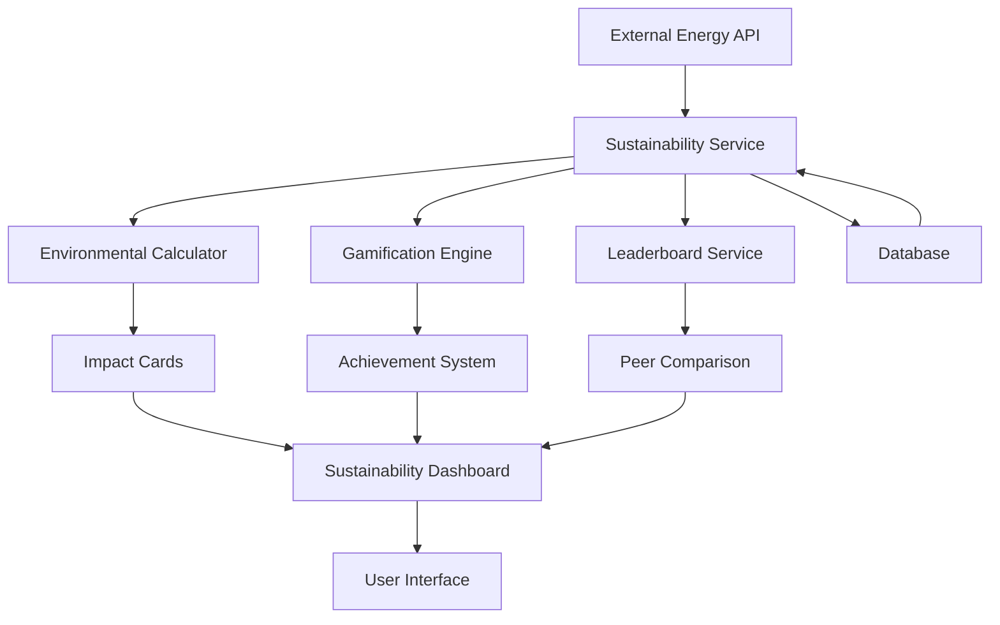
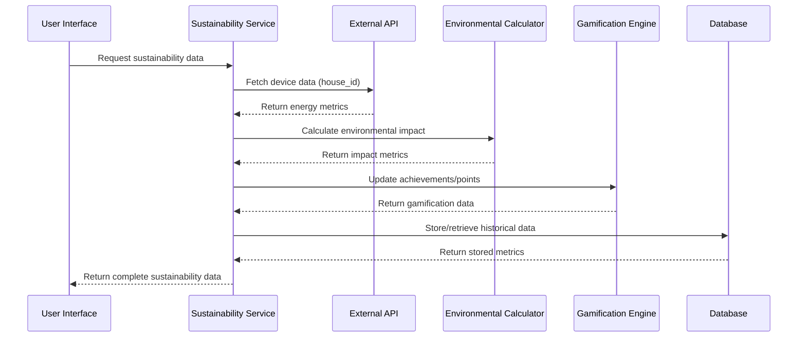

# Sustainability Board Design Document

## Overview

The Sustainability Board is a comprehensive environmental impact tracking and gamification system that transforms raw energy consumption data into meaningful sustainability metrics. The system integrates with the existing energy platform to provide users with real-time environmental impact visualization, peer comparisons, achievement recognition, and motivational challenges. The design emphasizes user engagement through gamification while maintaining scientific accuracy in environmental calculations.

## Architecture

### System Architecture



### Data Flow Architecture



## Components and Interfaces

### Core Components

#### 1. SustainabilityService
Primary service orchestrating all sustainability-related operations.

```typescript
interface SustainabilityService {
  getSustainabilityData(houseId: string): Promise<SustainabilityData>
  updateUserAchievements(userId: string, metrics: EnvironmentalMetrics): Promise<void>
  getLeaderboardData(userId: string): Promise<LeaderboardData>
  calculateSustainabilityScore(metrics: EnvironmentalMetrics): number
}
```

#### 2. EnvironmentalCalculator
Handles conversion of energy data to environmental impact metrics.

```typescript
interface EnvironmentalCalculator {
  calculateTreesSaved(co2Avoided: number): number
  calculateWaterSaved(energySaved: number): number
  calculateCO2Avoided(energyData: EnergyMetrics): number
  calculateCarbonFootprint(consumption: ConsumptionData): number
}
```

#### 3. GamificationEngine
Manages points, achievements, challenges, and user progression.

```typescript
interface GamificationEngine {
  awardPoints(userId: string, action: SustainabilityAction, value: number): Promise<void>
  checkAchievements(userId: string, metrics: EnvironmentalMetrics): Promise<Achievement[]>
  generateWeeklyChallenge(userId: string, historicalData: HistoricalMetrics): Challenge
  updateUserLevel(userId: string): Promise<UserLevel>
}
```

#### 4. LeaderboardService
Handles peer comparisons and ranking calculations.

```typescript
interface LeaderboardService {
  calculateUserRanking(userId: string, metric: LeaderboardMetric): Promise<UserRanking>
  getTopPerformers(metric: LeaderboardMetric, limit: number): Promise<LeaderboardEntry[]>
  generatePeerComparison(userId: string): Promise<PeerComparison>
}
```

## Data Models

### Core Data Structures

#### SustainabilityData
```typescript
interface SustainabilityData {
  userId: string
  houseId: string
  timestamp: string
  sustainabilityScore: number // 0-100
  environmentalMetrics: EnvironmentalMetrics
  achievements: Achievement[]
  gamificationData: GamificationData
  leaderboardPosition: LeaderboardPosition
  impactCards: ImpactCard[]
}
```

#### EnvironmentalMetrics
```typescript
interface EnvironmentalMetrics {
  treesSaved: number
  waterSaved: number // liters
  co2Avoided: number // kg
  energySaved: number // kWh
  costSavings: number // euros
  renewableUsagePercent: number
  peakLoadReduction: number // kWh
  smartDeviceEfficiency: number // 0-100
  carbonNeutralityProgress: number // 0-100
  homeEnergyHealthIndex: number // 0-100
  annualEnergyReduction: number // percentage
  standbyWasteReduction: number // kWh
  evChargingEfficiency: number // 0-100
  lightingEfficiency: number // 0-100
  hvacEfficiency: number // 0-100
  applianceHealthRating: number // 0-100
}
```

#### Achievement System
```typescript
interface Achievement {
  id: string
  name: string
  description: string
  icon: string
  category: AchievementCategory
  level: CertificationLevel
  earnedAt?: string
  progress: number // 0-100
  requirements: AchievementRequirement[]
}

type CertificationLevel = 
  | 'bronze_eco_saver'
  | 'silver_eco_saver' 
  | 'gold_sustainability_champion'
  | 'platinum_earth_guardian'
  | 'diamond_zero_carbon_leader'

type AchievementCategory =
  | 'energy_reduction'
  | 'carbon_footprint'
  | 'smart_optimization'
  | 'water_conservation'
  | 'renewable_usage'
```

#### Gamification Data
```typescript
interface GamificationData {
  totalPoints: number
  currentLevel: number
  levelProgress: number // 0-100
  activeStreaks: Streak[]
  activeChallenges: Challenge[]
  weeklyPoints: number
  monthlyPoints: number
}

interface Challenge {
  id: string
  title: string
  description: string
  target: number
  current: number
  reward: number // points
  deadline: string
  type: 'energy_reduction' | 'efficiency_improvement' | 'peak_avoidance'
}
```

#### Impact Cards
```typescript
interface ImpactCard {
  id: string
  title: string
  value: number
  unit: string
  icon: string
  description: string
  trend: 'up' | 'down' | 'stable'
  trendValue: number
  comparison?: string // e.g., "vs last month"
}
```

## Correctness Properties

*A property is a characteristic or behavior that should hold true across all valid executions of a system-essentially, a formal statement about what the system should do. Properties serve as the bridge between human-readable specifications and machine-verifiable correctness guarantees.*

<function_calls>
<invoke name="prework">
<parameter name="featureName">sustainability-board

### Property Reflection

After reviewing all properties identified in the prework analysis, several opportunities for consolidation emerge:

**Redundancy Analysis:**
- Properties 1.3, 5.2, and 5.3 all test mathematical conversions and can be combined into a single comprehensive conversion property
- Properties 1.2 and 5.1 both test metric display completeness and can be consolidated
- Properties 3.1, 3.2, and 3.3 all test achievement logic and can be combined into one comprehensive achievement property
- Properties 4.1, 4.2, 4.3, and 4.4 all test gamification mechanics and can be consolidated

**Consolidated Properties:**
The following properties provide unique validation value and will be implemented:

Property 1: API data display completeness
Property 2: Environmental conversion accuracy  
Property 3: Trend visualization completeness
Property 4: Leaderboard ranking accuracy
Property 5: Peer comparison calculation
Property 6: Achievement system correctness
Property 7: Gamification mechanics
Property 8: Impact card generation
Property 9: Navigation integration
Property 10: API error handling
Property 11: Data transformation accuracy
Property 12: Analytics calculation accuracy

### Correctness Properties

Property 1: API data display completeness
*For any* valid API response containing device data, the sustainability dashboard should display all required metrics including energy consumption, device efficiency, and renewable usage
**Validates: Requirements 1.1, 1.2, 5.1**

Property 2: Environmental conversion accuracy
*For any* energy consumption data, environmental conversions should use exact standardized formulas: CO₂-to-trees (22kg CO₂ per tree annually), energy-to-water (2.5 liters per kWh), and grid-to-CO₂ (0.475kg CO₂ per kWh)
**Validates: Requirements 1.3, 5.2, 5.3**

Property 3: Trend visualization completeness
*For any* sustainability data request, the system should provide daily, weekly, and monthly visualization options
**Validates: Requirements 1.4**

Property 4: Leaderboard ranking accuracy
*For any* set of user sustainability data, rankings should be calculated correctly based on CO₂ avoided, energy saved, efficiency improvements, and smart device utilization
**Validates: Requirements 2.1**

Property 5: Peer comparison calculation
*For any* user dataset, percentile calculations should be mathematically accurate and provide correct comparative statements like "You saved more energy than X% of users"
**Validates: Requirements 2.3**

Property 6: Achievement system correctness
*For any* user performance data, the system should award appropriate certifications based on energy reduction thresholds: Bronze (5-10%), Silver (10-20%), Gold (20-35%), Platinum (35-50%), Diamond (net-negative carbon)
**Validates: Requirements 3.1, 3.2, 3.3**

Property 7: Gamification mechanics
*For any* user sustainability actions, the system should award points correctly, generate appropriate weekly challenges, calculate streak bonuses accurately, and manage level progression based on lifetime points
**Validates: Requirements 4.1, 4.2, 4.3, 4.4**

Property 8: Impact card generation
*For any* environmental metrics, impact cards should include all required elements: trees saved, water conserved, CO₂ emissions avoided, energy savings, cost savings, with proper visual formatting
**Validates: Requirements 5.1, 5.4, 5.5**

Property 9: Navigation integration
*For any* user accessing the application, the "Sustainability Board" menu item should be present and accessible from the main sidebar
**Validates: Requirements 6.1**

Property 10: API error handling
*For any* external API failure scenario, the system should handle errors gracefully, display cached data with staleness indicators, and implement retry mechanisms
**Validates: Requirements 6.2, 6.5**

Property 11: Data transformation accuracy
*For any* API response format, device-level energy metrics should be correctly transformed into sustainability calculations and stored persistently
**Validates: Requirements 6.3, 6.4**

Property 12: Analytics calculation accuracy
*For any* device performance data, composite scores (Home Energy Health Index, Carbon Neutrality Progress, Smart Device Efficiency) should be calculated consistently and optimization opportunities should be identified correctly
**Validates: Requirements 7.1, 7.2, 7.3, 7.4, 7.5**

## Error Handling

### API Integration Error Handling
- **Connection Failures**: Implement exponential backoff retry mechanism with maximum 3 attempts
- **Timeout Handling**: 5-second timeout with graceful degradation to cached data
- **Invalid Response**: Validate API response structure and provide meaningful error messages
- **Rate Limiting**: Implement request throttling and queue management

### Data Processing Error Handling
- **Calculation Errors**: Validate input data ranges and handle division by zero scenarios
- **Missing Data**: Provide default values and clear indicators when data is unavailable
- **Conversion Failures**: Log conversion errors and use fallback calculations
- **Database Errors**: Implement transaction rollback and data consistency checks

### User Experience Error Handling
- **Loading States**: Display skeleton screens during data fetching
- **Error Messages**: Provide user-friendly error descriptions with suggested actions
- **Fallback Content**: Show cached or default content when real-time data is unavailable
- **Progressive Enhancement**: Ensure core functionality works even with partial data

## Testing Strategy

### Dual Testing Approach

The Sustainability Board will implement both unit testing and property-based testing to ensure comprehensive coverage:

**Unit Testing Approach:**
- Test specific examples of environmental calculations with known inputs and outputs
- Verify integration points between sustainability service and external APIs
- Test error handling scenarios with mocked failure conditions
- Validate UI component rendering with sample data
- Test database operations with controlled datasets

**Property-Based Testing Approach:**
- Use **fast-check** as the property-based testing library for TypeScript/JavaScript
- Configure each property-based test to run a minimum of 100 iterations
- Tag each property-based test with comments explicitly referencing the design document properties
- Use the exact format: '**Feature: sustainability-board, Property {number}: {property_text}**'

**Property-Based Test Requirements:**
- Each correctness property must be implemented by a single property-based test
- Tests should generate random but valid input data within realistic ranges
- Generators should create smart constraints (e.g., energy values between 0-10000 kWh)
- Properties should verify mathematical relationships and business logic invariants
- Error conditions should be tested with invalid input generators

**Test Coverage Goals:**
- Unit tests focus on specific examples and integration points
- Property tests verify universal properties across all valid inputs
- Combined approach ensures both concrete bug detection and general correctness verification
- Minimum 90% code coverage across all sustainability-related modules

### Testing Implementation Details

**Environmental Calculation Testing:**
- Property tests for conversion formulas with random energy values
- Unit tests for edge cases (zero values, maximum thresholds)
- Integration tests for API data transformation pipeline

**Gamification System Testing:**
- Property tests for point calculation across various user actions
- Unit tests for achievement threshold boundaries
- Integration tests for challenge generation and completion

**Leaderboard Testing:**
- Property tests for ranking algorithms with random user datasets
- Unit tests for percentile calculation edge cases
- Performance tests for large user populations

## Implementation Notes

### Performance Considerations
- Implement caching strategy for frequently accessed sustainability metrics
- Use database indexing for efficient leaderboard queries
- Optimize environmental calculations to avoid redundant computations
- Implement lazy loading for historical trend data

### Security Considerations
- Anonymize user data in leaderboard comparisons
- Validate all external API inputs to prevent injection attacks
- Implement rate limiting for sustainability data requests
- Secure storage of user achievement and gamification data

### Scalability Considerations
- Design leaderboard system to handle thousands of concurrent users
- Implement efficient batch processing for daily metric calculations
- Use message queues for asynchronous achievement processing
- Plan for horizontal scaling of sustainability calculation services